# BioFlow — Sistema Inteligente de Gestão de Laboratório Biotecnológico

## Sobre o Projeto

O **BioFlow** é uma aplicação web desenvolvida para centralizar as principais operações de um laboratório biotecnológico em um único sistema. A plataforma substitui registros em papel, planilhas dispersas e controles manuais por uma solução digital com rastreabilidade, organização e controle de acesso por perfil.

O sistema permite acompanhar amostras, reagentes, equipamentos, agendamentos, experimentos, análises laboratoriais, movimentações de estoque e usuários, oferecendo uma visão integrada do funcionamento do laboratório.

## Problema Resolvido

Laboratórios universitários e de pesquisa frequentemente enfrentam problemas como:

- perda de rastreabilidade de amostras;
- uso de reagentes vencidos ou com estoque insuficiente;
- conflitos no agendamento de equipamentos compartilhados;
- dificuldade para acompanhar experimentos, responsáveis e resultados;
- informações espalhadas em planilhas, documentos físicos e comunicações informais.

O **BioFlow** resolve esses problemas ao reunir as informações em uma aplicação web organizada, responsiva e com histórico de operações.

## Tecnologias Utilizadas

| Camada | Tecnologias |
|---|---|
| Backend | Python 3.11, Django 5.x, Django REST Framework |
| Frontend | HTML5, CSS3, Bootstrap 5.3, JavaScript, Chart.js |
| Banco de Dados | SQLite em ambiente de desenvolvimento |
| Ferramentas | Git, GitHub, Postman |

## Funcionalidades Principais

- Dashboard inteligente com métricas, alertas e gráficos interativos;
- autenticação de usuários e controle de permissões por perfil;
- gestão de reagentes com alerta de validade e baixo estoque;
- cadastro e controle de equipamentos laboratoriais;
- agendamento de equipamentos com prevenção automática de conflitos;
- rastreamento de amostras com geração automática de código único;
- registro de experimentos vinculando responsáveis, reagentes, amostras e protocolos;
- controle de estoque com histórico de entradas e saídas;
- cadastro de análises laboratoriais e resultados;
- API REST com autenticação por token.

## Integrantes da Equipe e Organização das Features

A organização das funcionalidades foi baseada na divisão de módulos do projeto BioFlow e no padrão de commits semânticos utilizado no versionamento.

| Integrante | Feature / Módulo | Função no Projeto |
|---|---|---|
| Adejanildo Pereira | `accounts` / usuários | Criação da estrutura inicial do sistema, tela de login, autenticação, perfis e gerenciamento de permissões de usuários. |
| Leonardo Andrade Fontes Dos Santos | `reagents` e `inventory` | Implementação do gerenciamento de reagentes, CRUD, controle de estoque, níveis mínimos, validade e alertas automáticos. |
| Vinicius Nobre Libanio Couto | `protocols` | Implementação do módulo de protocolos laboratoriais, com cadastro, edição, consulta, categorização e documentos associados. |
| Giovana Quintella Santarosa | `equipments` e `analysis` | Desenvolvimento do cadastro, status e gerenciamento de equipamentos, além do módulo de análises laboratoriais com resultados e responsáveis técnicos. |
| Daniel Salgueiro Puga Paiva de Andrade | `schedules` | Implementação do sistema de agendamento de equipamentos com validação de conflitos de horário. |
| Lucas Furtado | `experiments` e `README.md` | Criação do módulo de experimentos com associação entre reagentes, equipamentos e responsáveis; elaboração do README com instalação, execução e imagens das telas. |
| Bruno Barbosa | `samples` | Implementação do gerenciamento de amostras e protocolos laboratoriais com rastreabilidade. |
| Jonas Maximo Belo Santos | `dashboard` | Criação do dashboard administrativo com indicadores de estoque, uso de equipamentos, experimentos, métricas e gráficos. |
| Jefferson Gonçalves | `api` | Implementação da API REST para integração dos módulos e disponibilização de análises laboratoriais. |
| Priscilla Gavino Afonso | `docs/api.md` | Documentação dos endpoints da API REST e exemplos de requisições. |

### Commits / Features de Referência

```text
chore: criação da estrutura inicial do sistema BioFlow (Adejanildo Pereira)
chore: criação da estrutura inicial modular do sistema BioFlow (Adejanildo Pereira)
feat(usuário): criação da tela de login, autenticação e gerenciamento de permissões de usuários (Adejanildo Pereira)
feat(estoque): implementação do módulo de controle de estoque com monitoramento de níveis mínimos e geração automática de alertas (Leonardo Andrade)
feat(reagentes): implementação do gerenciamento de reagentes, incluindo cadastro, consulta, edição e remoção de registros (Leonardo Andrade)
feat(protocolos): implementação do módulo de protocolos laboratoriais com cadastro, edição, consulta, categorização e gerenciamento de documentos associados (Vinícius Nobre)
feat(equipamentos): desenvolvimento do módulo de cadastro, status e gerenciamento de equipamentos laboratoriais (Giovana Santarosa)
feat(agendamento): implementação do sistema de agendamento de equipamentos com validação de conflitos de horário (Daniel Salgueiro)
feat(experimentos): criação do módulo de experimentos com associação entre reagentes, equipamentos e responsáveis (Lucas Furtado)
feat(amostras): implementação do gerenciamento de amostras e protocolos laboratoriais com rastreabilidade (Bruno Barbosa)
feat(dashboard): criação do dashboard administrativo com indicadores de estoque, uso de equipamentos e experimentos (Jonas Santos)
feat(api): implementação da API REST para integração dos módulos e disponibilização de análises laboratoriais (Jefferson Gonçalves)
feat(análises): implementação do módulo de análises laboratoriais com registro de resultados, filtros por tipo, associação a experimentos e controle de responsáveis técnicos (Giovana Santarosa)
docs: adiciona documentação das telas do sistema (Adejanildo Pereira)
docs: README com instruções de instalação, configuração e execução do sistema (Lucas Furtado)
docs(api): documentação dos endpoints da API REST e exemplos de requisições (Priscilla Gavino)
```

## Instalação e Execução

### Pré-requisitos

Antes de executar o projeto, é necessário ter instalado:

- Python 3.11 ou superior;
- pip;
- Git.

### 1. Clonar o repositório

```bash
git clone https://github.com/adejanildo/bioflow_project.git
cd bioflow_project
```

### 2. Criar o ambiente virtual

#### Linux/Mac

```bash
python -m venv venv
source venv/bin/activate
```

#### Windows

```bash
python -m venv venv
venv\Scripts\activate
```

### 3. Instalar as dependências

```bash
pip install -r requirements.txt
```

### 4. Aplicar as migrações do banco de dados

```bash
python manage.py migrate
```

### 5. Popular o banco com dados iniciais

```bash
python manage.py seed
```

### 6. Executar o servidor local

```bash
python manage.py runserver
```

Após iniciar o servidor, acesse no navegador:

```text
http://127.0.0.1:8000
```

## Credenciais de Demonstração

| Usuário | Senha | Perfil |
|---|---|---|
| `admin` | `admin123` | Administrador |
| `ana.costa` | `bio2026` | Pesquisador |
| `tecnico1` | `bio2026` | Técnico |

## Documentação das Telas

As imagens das telas estão localizadas na pasta:

```text
Documentação/imagens/
```

> Observação: os caminhos abaixo consideram que este `README.md` está na raiz do projeto. Caso o arquivo seja colocado dentro da pasta `Documentação/`, altere os caminhos das imagens para `imagens/nome_da_imagem.png`.

### 1. Login

Tela responsável pela autenticação dos usuários e controle de acesso ao sistema por perfil.

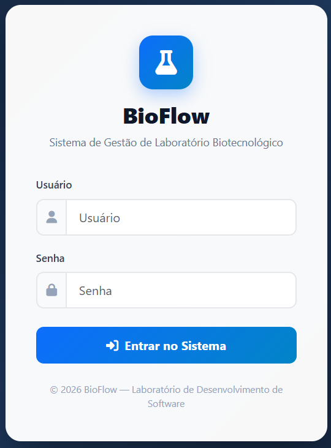

---

### 2. Dashboard

Painel inicial com visão geral do sistema, métricas principais, alertas e gráficos interativos.

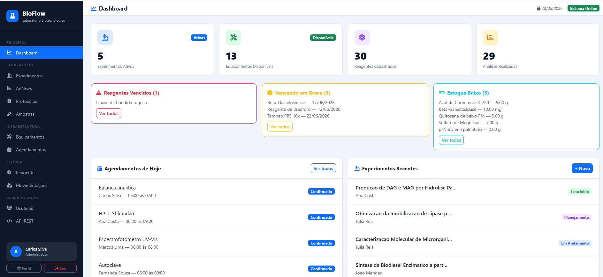

---

### 3. Lista de Reagentes

Tela de consulta dos reagentes cadastrados, exibindo validade, quantidade disponível, categoria e alertas de estoque.

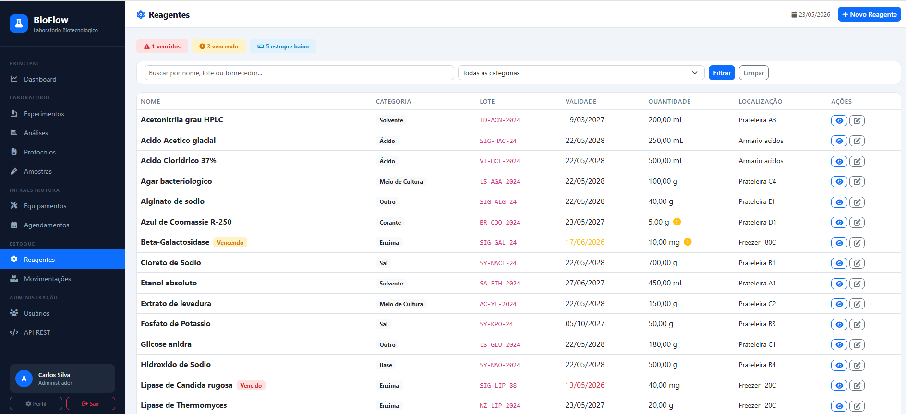

---

### 4. Cadastro de Reagente

Formulário utilizado para cadastrar novos reagentes, informando dados como nome, quantidade, unidade, validade, localização e notas de segurança.

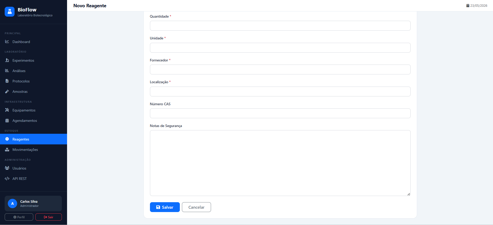

---

### 5. Lista de Equipamentos

Tela que lista os equipamentos laboratoriais cadastrados, seus respectivos status, localização, modelo e informações de manutenção.

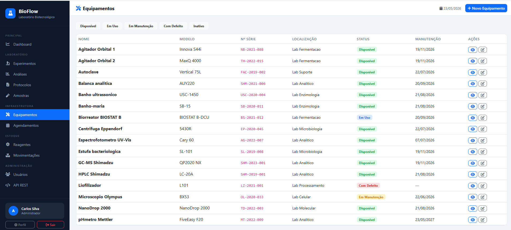

---

### 6. Agendamento de Equipamento

Tela utilizada para reservar equipamentos, evitando conflitos de horário entre usuários.

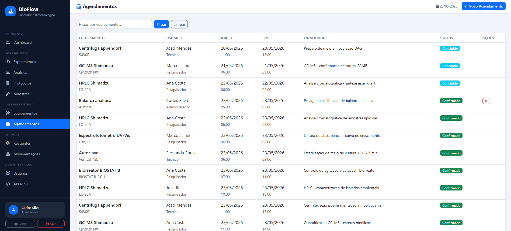

---

### 7. Lista de Experimentos

Tela de listagem dos experimentos cadastrados, permitindo acompanhar status, responsáveis, datas de início e conclusão.

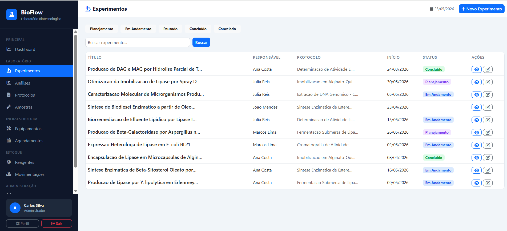

---

### 8. Detalhe do Experimento

Tela com informações completas de um experimento, incluindo descrição, responsável, protocolo, amostras e análises vinculadas.

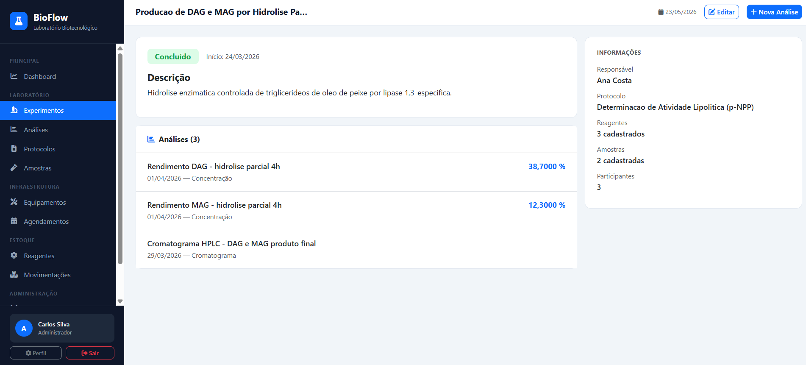

---

### 9. Cadastro de Amostra

Tela destinada ao registro e acompanhamento de amostras laboratoriais, com geração automática de código único para rastreabilidade.

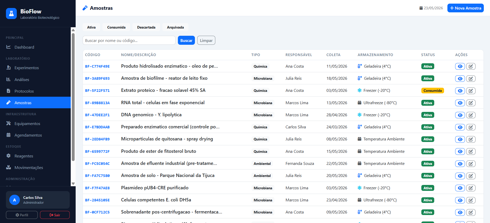

---

### 10. Movimentação de Estoque

Tela para registrar entradas e saídas de reagentes e insumos, mantendo histórico de movimentações e responsáveis.

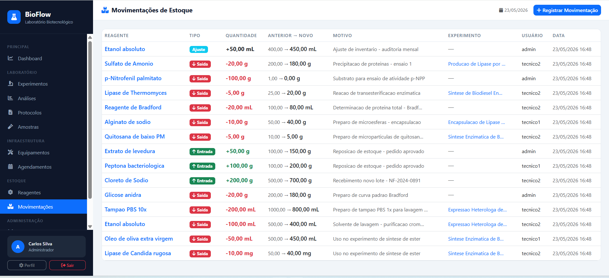

---

### 11. API REST

Interface de consulta e integração da API REST, permitindo acessar os endpoints do sistema e testar requisições.

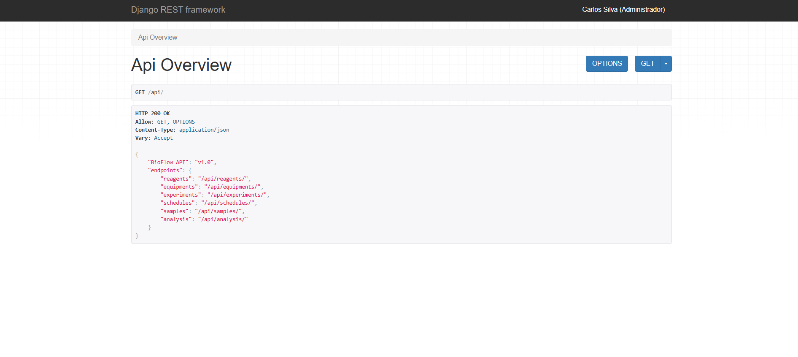

---

### 12. Gerenciamento de Usuários

Tela administrativa para cadastro, edição e gerenciamento de usuários, permissões e perfis de acesso.

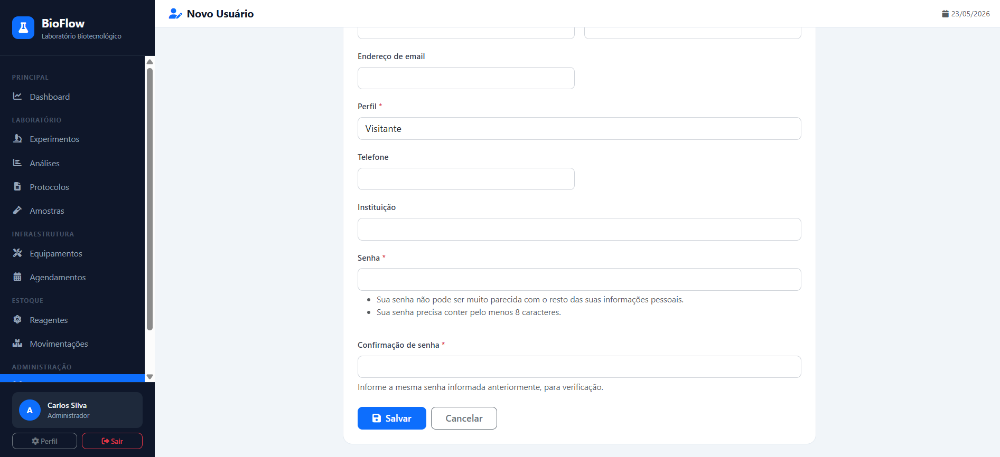

## Estrutura do Projeto

```text
bioflow_project/
├── accounts/              # Autenticação e usuários
├── reagents/              # Gestão de reagentes
├── equipments/            # Cadastro de equipamentos
├── schedules/             # Agendamento de equipamentos
├── protocols/             # Protocolos laboratoriais
├── samples/               # Rastreamento de amostras
├── experiments/           # Gestão de experimentos
├── analysis/              # Registro de análises
├── inventory/             # Controle de estoque
├── dashboard/             # Painel administrativo
├── api/                   # API REST
├── templates/             # Templates HTML
├── static/                # Arquivos CSS
├── manage.py
├── requirements.txt
├── Documentação/
│   ├── DOCUMENTACAO_TELAS.pdf
│   ├── RELATORIO_FINAL.pdf
│   ├── api.md
│   └── imagens/
│       ├── login.png
│       ├── dashboard.png
│       ├── lista_reagentes.png
│       ├── cadastro_reagente.png
│       ├── equipamentos.png
│       ├── agendamento.png
│       ├── experimentos.png
│       ├── detalhe_experimento.png
│       ├── amostras.png
│       ├── movimentacao_estoque.png
│       ├── api_rest.png
│       └── usuarios.png
├── .gitignore
└── README.md
```

## Arquitetura da Aplicação

```text
Usuário no navegador
        ↓
Frontend — HTML, Bootstrap 5 e JavaScript
        ↓
Views Django
        ↓
Services e Regras de Negócio
        ↓
Models — Django ORM
        ↓
Banco de Dados — SQLite
```

O sistema segue a arquitetura MTV do Django, separando regras de negócio, modelos de dados e templates de interface.

## API REST

A API REST está disponível a partir da rota:

```text
/api/
```

A autenticação é realizada por Token.

### Endpoints Principais

| Método | Endpoint | Descrição |
|---|---|---|
| GET/POST | `/api/reagents/` | Listar e criar reagentes |
| GET/PUT/DELETE | `/api/reagents/{id}/` | Detalhar, editar e excluir reagentes |
| GET/POST | `/api/equipments/` | Listar e criar equipamentos |
| GET/POST | `/api/experiments/` | Listar e criar experimentos |
| GET/POST | `/api/schedules/` | Listar e criar agendamentos |
| GET/POST | `/api/samples/` | Listar e criar amostras |
| GET/POST | `/api/analysis/` | Listar e criar análises |

### Obter Token de Autenticação

```bash
curl -X POST http://localhost:8000/api-token-auth/ \
  -d "username=admin&password=admin123"
```

### Usar Token em uma Requisição

```bash
curl -H "Authorization: Token SEU_TOKEN" \
  http://localhost:8000/api/reagents/
```

## Organização Ágil

O desenvolvimento foi organizado em sprints, contemplando levantamento de requisitos, estruturação do projeto, implementação dos módulos, integração da API, criação do dashboard, documentação e entrega final.

## Versionamento

O projeto utiliza Git e GitHub para controle de versão. Os commits seguem o padrão de commits semânticos, como:

```text
chore: criação da estrutura inicial do sistema BioFlow
feat(usuário): criação da tela de login, autenticação e gerenciamento de permissões
feat(estoque): implementação do módulo de controle de estoque
feat(reagentes): implementação do gerenciamento de reagentes
docs: adiciona documentação das telas do sistema
docs: README com instruções de instalação, configuração e execução do sistema
```
```

## Licença

Projeto acadêmico desenvolvido para a disciplina **Laboratório de Desenvolvimento de Software**.

**Universidade Veiga de Almeida — UVA**  
**Professor Paulo Andrade**  
**2026**
